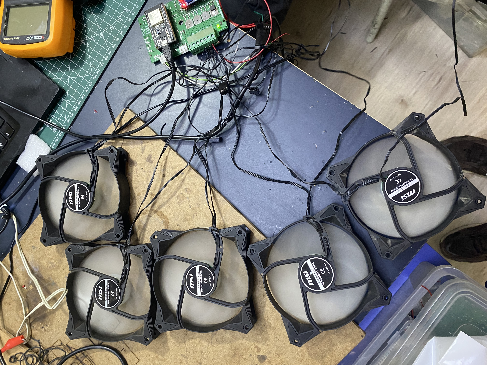

# Wi-Fi Sniffer-Driven Fan Controller with ESP32

  

This project uses an ESP32 microcontroller to capture Wi-Fi traffic and trigger a fan based on detected network activity.

## Features
- Sniffs Wi-Fi packets using ESP32
- Controls a fan according to network traffic intensity
- Demonstrates the physicalization of invisible digital signals

## Files
- `.ino` files: Arduino code for ESP32
- Circuit diagrams and PCB layouts

## Requirements
- ESP32 development board
- A fan (5V or 12V depending on your setup)
- Basic electronic components (transistor, resistor, power supply)

## How it works
The ESP32 monitors Wi-Fi packets and turns the fan on/off depending on traffic density.

---

